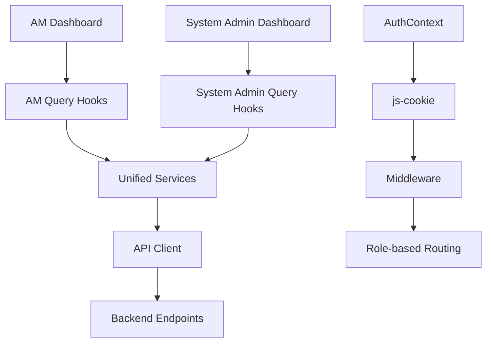

# Design Document

## Overview

This design outlines the systematic approach to decouple custom authentication components and ensure backend integration parity between Account Manager and System Admin dashboards. The solution focuses on removing merge conflicts while maintaining full functionality through the official Branch Manager authentication system.

## Architecture

### Current State Analysis

**Authentication Systems:**
- **Custom System**: authManager.ts, auth.ts, authFix.ts with complex token management
- **Official System**: AuthContext.tsx + js-cookie + middleware with role-based routing

**Dashboard Integration:**
- **System Admin**: Full backend integration using unified services and query hooks
- **Account Manager**: Mixed implementation with mocked data and partial backend integration

### Target Architecture

**Unified Authentication Flow:**
```
User Login → AuthService.login() → AuthContext.login() → js-cookie storage → Middleware routing → Role-based dashboard
```

**Unified Dashboard Pattern:**
```
Dashboard Component → Query Hooks → Unified Services → API Client → Backend Endpoints
```

## Components and Interfaces

### Authentication Component Changes

#### API Client (lib/api/client.ts)
**Current Implementation:**
```typescript
// Uses authenticationManager for token retrieval
const authHeaders = await authenticationManager.getAuthHeaders();
```

**Target Implementation:**
```typescript
// Direct js-cookie usage
import Cookies from 'js-cookie';

private async getDefaultHeaders(): Promise<Record<string, string>> {
  const headers: Record<string, string> = {
    'Content-Type': 'application/json',
  };

  const token = Cookies.get('token');
  if (token) {
    headers['Authorization'] = `Bearer ${token}`;
  }

  return headers;
}
```

#### AuthContext (app/context/AuthContext.tsx)
**Modifications:**
- Remove authenticationManager imports and synchronization
- Rely solely on localStorage and js-cookie for session management
- Maintain existing interface for backward compatibility

#### Service Layer Updates
**Pattern for all services (activityLogs.ts, systemSettings.ts):**
```typescript
// Remove these imports:
// import { authenticationManager } from '../api/authManager';
// import { autoFixAuthentication } from '../utils/authFix';

// Remove authentication debugging and auto-fix logic
// Rely on unified API client's built-in error handling
```

### Dashboard Integration Architecture

#### Query Hook Pattern
**System Admin Pattern (existing):**
```typescript
// app/dashboard/system-admin/queries/useSystemAdminQueries.ts
export function useDisbursementsQuery(page: number = 1, limit: number = 10) {
  return useQuery<PaginatedResponse<DisbursementRecord>, AxiosError>({
    queryKey: ["system-admin", "disbursements", page, limit],
    queryFn: () => systemAdminService.getDisbursements(page, limit),
    staleTime: 5 * 60 * 1000,
    retry: 2,
  });
}
```

**AM Pattern (to be created):**
```typescript
// app/dashboard/am/queries/useAMQueries.ts
export function useDisbursementsQuery(page: number = 1, limit: number = 10) {
  return useQuery<PaginatedResponse<DisbursementRecord>, AxiosError>({
    queryKey: ["account-manager", "disbursements", page, limit],
    queryFn: () => systemAdminService.getDisbursements(page, limit), // Same service
    staleTime: 5 * 60 * 1000,
    retry: 2,
  });
}
```

#### Dashboard Data Flow


## Data Models

### Authentication Data Flow
```typescript
interface AuthenticationFlow {
  // Input: Login credentials
  credentials: LoginCredentials;
  
  // Processing: AuthService response
  authResponse: {
    access_token: string;
    role: string; // API format: 'system_admin', 'account_manager', 'branch_manager'
  };
  
  // Storage: AuthContext + js-cookie
  session: {
    token: string;
    role: string; // Middleware format: 'ADMIN', 'ACCOUNT_MANAGER', 'BRANCH_MANAGER'
  };
  
  // Routing: Middleware decision
  dashboardRoute: '/dashboard/system-admin' | '/dashboard/am' | '/dashboard/bm';
}
```

### Dashboard Data Models
```typescript
interface DashboardDataFlow {
  // Unified KPI structure (both dashboards)
  kpis: DashboardKPIs;
  
  // Unified tabular data (both dashboards)
  disbursements: PaginatedResponse<DisbursementRecord>;
  recollections: PaginatedResponse<RecollectionRecord>;
  savings: PaginatedResponse<SavingsRecord>;
  missedPayments: PaginatedResponse<MissedPaymentRecord>;
  
  // Unified performance data (both dashboards)
  branchPerformance: {
    bestPerformingBranches: BranchPerformance[];
    worstPerformingBranches: BranchPerformance[];
  };
}
```

## Correctness Properties

*A property is a characteristic or behavior that should hold true across all valid executions of a system-essentially, a formal statement about what the system should do. Properties serve as the bridge between human-readable specifications and machine-verifiable correctness guarantees.*

Based on the prework analysis, the following properties ensure the authentication decoupling and dashboard integration work correctly:

### Authentication Decoupling Properties

**Property 1: Token Retrieval Consistency**
*For any* API request made by the system, the Authorization header should contain the token retrieved directly from js-cookie, not from authenticationManager
**Validates: Requirements 1.1, 9.1**

**Property 2: Authentication Error Handling**
*For any* authentication failure, the system should rely on official AuthContext error handling without invoking custom auth fix methods
**Validates: Requirements 1.2, 3.3, 9.2**

**Property 3: Login Flow Purity**
*For any* user login operation, only official LoginForm and AuthContext methods should be called, with no authenticationManager synchronization
**Validates: Requirements 1.3, 9.3**

**Property 4: Service Authentication Consistency**
*For any* service making API calls, token retrieval should use js-cookie directly without authenticationManager or auto-fix logic
**Validates: Requirements 3.1, 3.2, 3.4**

### Dashboard Integration Properties

**Property 5: Backend Endpoint Consistency**
*For any* data type (KPIs, disbursements, recollections, savings, missed payments), both AM and System Admin dashboards should use identical backend endpoints
**Validates: Requirements 4.1, 5.4**

**Property 6: Service Method Consistency**
*For any* dashboard data operation, both AM and System Admin dashboards should call the same unified service methods (accurateDashboardService, branchPerformanceService, systemAdminService)
**Validates: Requirements 4.2, 4.3, 5.1, 5.2**

**Property 7: Query Hook Structure Consistency**
*For any* tabular data query (disbursements, recollections, savings, missed payments), AM dashboard query hooks should have identical structure and behavior to System Admin query hooks
**Validates: Requirements 4.4, 4.7**

**Property 8: Data Transformation Consistency**
*For any* data received from backend endpoints, both AM and System Admin dashboards should apply identical transformation logic and produce consistent output formats
**Validates: Requirements 4.8, 5.3, 8.4**

### Role-Based Access Properties

**Property 9: Role-Based Routing**
*For any* user login with a specific role (system_admin, account_manager, branch_manager), the system should redirect to the corresponding dashboard (/dashboard/system-admin, /dashboard/am, /dashboard/bm)
**Validates: Requirements 6.1, 6.2, 6.3**

**Property 10: Role Conversion Consistency**
*For any* API role format input, the middleware should convert it to the correct middleware format using the established role mapping
**Validates: Requirements 6.4, 6.5**

### Settings and Error Handling Properties

**Property 11: Settings Endpoint Consistency**
*For any* settings operation (read, update), both AM and System Admin settings pages should use identical backend endpoints and service methods
**Validates: Requirements 7.1, 7.2, 7.3**

**Property 12: Error Handling Consistency**
*For any* API error or backend unavailability, both AM and System Admin dashboards should display identical error messages, loading states, and fallback behavior
**Validates: Requirements 7.4, 8.1, 8.2, 8.3**

**Property 13: Session State Preservation**
*For any* navigation between dashboards, the user session state should be maintained correctly without loss of authentication or role information
**Validates: Requirements 10.3, 10.5**

## Error Handling

### Authentication Error Scenarios
1. **Token Expiration**: Middleware handles redirect to login without custom auth fixes
2. **Invalid Token**: API client returns 401/403, middleware redirects to login
3. **Network Errors**: Unified API client handles retries and error display

### Dashboard Data Error Scenarios
1. **Backend Unavailable**: Both dashboards show identical error messages and fallback data
2. **API Timeout**: Both dashboards handle timeouts with same retry logic and user feedback
3. **Data Transformation Errors**: Both dashboards apply same error handling and default values

### File Deletion Safety
1. **Import Validation**: TypeScript compilation ensures no references to deleted files
2. **Runtime Validation**: Application startup verifies no missing dependencies
3. **Graceful Degradation**: Removed authentication components don't break existing functionality

## Testing Strategy

### Dual Testing Approach
- **Unit tests**: Verify specific examples, file deletions, and component behavior
- **Property tests**: Verify universal properties across all authentication and dashboard scenarios

### Unit Testing Focus
- File existence/deletion verification
- Static code analysis for removed imports
- Specific login flow examples
- Settings page functionality examples
- Error handling edge cases

### Property Testing Focus
- Token retrieval consistency across all API calls
- Dashboard endpoint usage across all data types
- Role-based routing across all user roles
- Error handling consistency across all failure scenarios
- Data transformation consistency across all backend responses

### Testing Configuration
- Minimum 100 iterations per property test
- Each property test references its design document property
- Tag format: **Feature: auth-decoupling-merge-prep, Property {number}: {property_text}**
- Both unit and property tests are required for comprehensive coverage
