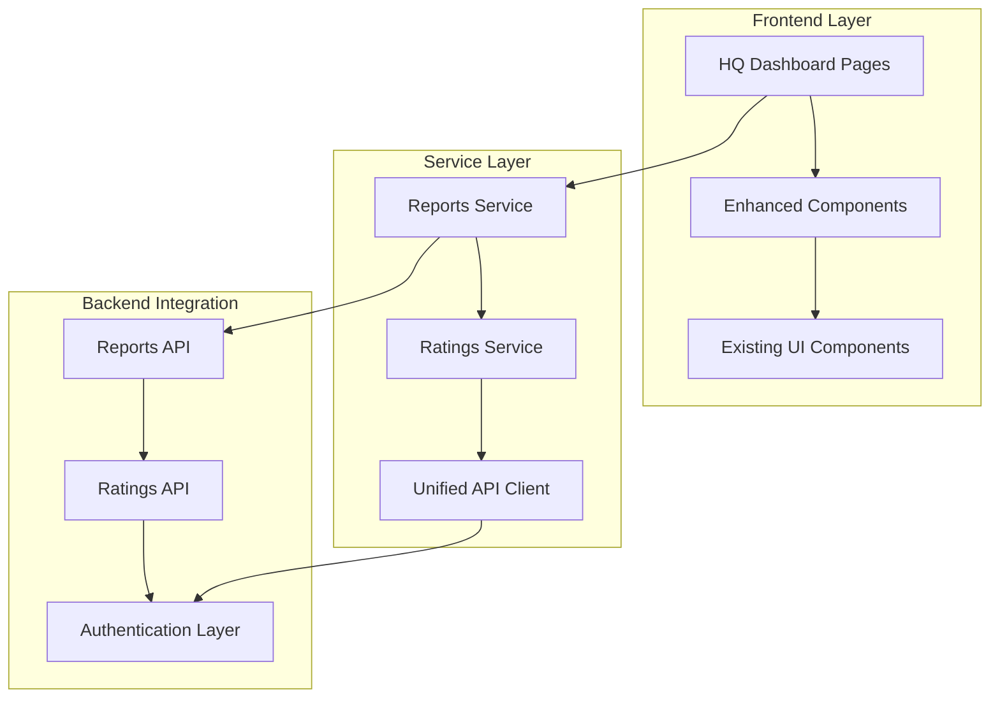

# Design Document: Kaytop HQ Dashboard Enhancements

## Overview

The Kaytop HQ Dashboard Enhancement system extends the existing microfinance platform with advanced report review capabilities and branch performance analytics. The design integrates seamlessly with the current React/TypeScript architecture, maintaining consistency with existing UI patterns while introducing powerful new features for HQ managers.

The system consists of two primary enhancements:
1. **Report Review Workflow**: Branch-aggregated report views with approval/rejection capabilities
2. **Branch Performance Leaderboard**: Real-time performance rankings and metrics calculation

## Architecture

### System Architecture

The enhancement follows the existing layered architecture:



### Component Architecture

The design leverages existing components and introduces minimal new ones:

- **Enhanced Reports Page**: Extends `app/dashboard/am/reports/page.tsx`
- **Enhanced Branches Page**: Extends `app/dashboard/am/branches/page.tsx`
- **New Components**: 
  - `BranchAggregateTable`: Specialized table for branch-level report data
  - `PerformanceLeaderboard`: Ranking display component
  - `RatingsCalculator`: Performance calculation interface

## Components and Interfaces

### Enhanced Reports Service

```typescript
interface EnhancedReportsService extends ReportsService {
  // Branch aggregate methods
  getBranchAggregateReports(filters?: BranchReportFilters): Promise<PaginatedResponse<BranchReport>>;
  
  // HQ review methods
  hqApproveReport(id: string, data: HQReviewData): Promise<Report>;
  hqRejectReport(id: string, data: HQReviewData): Promise<Report>;
}

interface BranchReport {
  id: string;
  branchName: string;
  totalSavings: number;
  totalDisbursed: number;
  totalRepaid: number;
  status: 'pending' | 'approved' | 'declined';
  reportCount: number;
  lastSubmissionDate: string;
  creditOfficerCount: number;
}

interface HQReviewData {
  action: 'APPROVE' | 'DECLINE';
  remarks: string;
}
```

### Ratings Service

```typescript
interface RatingsService {
  calculateRatings(period: RatingPeriod): Promise<RatingCalculationResult>;
  getLeaderboard(filters?: LeaderboardFilters): Promise<BranchRating[]>;
  getBranchRating(branchName: string): Promise<BranchRating>;
}

interface BranchRating {
  branchName: string;
  rank: number;
  totalScore: number;
  savingsScore: number;
  disbursementScore: number;
  repaymentScore: number;
  period: RatingPeriod;
  calculatedAt: string;
}

interface LeaderboardFilters {
  type?: 'SAVINGS' | 'MONEY_DISBURSED' | 'LOAN_REPAYMENT';
  period?: RatingPeriod;
  limit?: number;
}

type RatingPeriod = 'DAILY' | 'WEEKLY' | 'MONTHLY' | 'QUARTERLY' | 'YEARLY';
```

### UI Component Interfaces

```typescript
interface BranchAggregateTableProps {
  data: BranchReport[];
  loading: boolean;
  onRowClick: (report: BranchReport) => void;
  onSelectionChange: (selectedIds: string[]) => void;
  sortColumn?: string;
  sortDirection?: 'asc' | 'desc';
  onSort: (column: string) => void;
}

interface PerformanceLeaderboardProps {
  ratings: BranchRating[];
  loading: boolean;
  selectedType: LeaderboardType;
  selectedPeriod: RatingPeriod;
  onTypeChange: (type: LeaderboardType) => void;
  onPeriodChange: (period: RatingPeriod) => void;
  onCalculateRatings: () => void;
}

interface HQReviewModalProps {
  isOpen: boolean;
  report: BranchReport | null;
  onClose: () => void;
  onApprove: (comments?: string) => void;
  onReject: (reason: string, comments?: string) => void;
  loading: boolean;
}
```

## Data Models

### Branch Report Data Model

```typescript
interface BranchReportData {
  // Aggregated from individual reports
  branchId: string;
  branchName: string;
  
  // Financial metrics (sum of all reports in branch)
  totalSavings: number;
  totalDisbursed: number;
  totalRepaid: number;
  
  // Report metadata
  reportCount: number;
  pendingReports: number;
  approvedReports: number;
  declinedReports: number;
  
  // Timestamps
  lastSubmissionDate: string;
  oldestPendingDate?: string;
  
  // Staff information
  creditOfficerCount: number;
  activeCreditOfficers: string[];
  
  // Status determination logic
  overallStatus: 'pending' | 'approved' | 'declined' | 'mixed';
}
```

### Performance Rating Data Model

```typescript
interface PerformanceMetrics {
  // Raw performance data
  savingsCollected: number;
  loansDispursed: number;
  repaymentsReceived: number;
  
  // Calculated scores (0-100)
  savingsScore: number;
  disbursementScore: number;
  repaymentScore: number;
  
  // Composite score
  overallScore: number;
  
  // Ranking information
  rank: number;
  totalBranches: number;
  
  // Period information
  period: RatingPeriod;
  periodStart: string;
  periodEnd: string;
}
```

## Error Handling

### Error Handling Strategy

The system implements comprehensive error handling following existing patterns:

```typescript
class EnhancedErrorHandler extends UnifiedAPIErrorHandler {
  // HQ-specific error handling
  handleHQReviewError(error: unknown, context: string): void {
    if (this.isAuthorizationError(error)) {
      this.redirectToLogin();
      return;
    }
    
    if (this.isRolePermissionError(error)) {
      this.showRoleError('HQ Manager access required');
      return;
    }
    
    // Standard error handling
    this.handleStandardError(error, context);
  }
  
  // Ratings calculation error handling
  handleRatingsError(error: unknown): RatingCalculationResult {
    console.error('Ratings calculation failed:', error);
    
    return {
      success: false,
      error: this.extractErrorMessage(error),
      fallbackData: this.getEmptyRatings()
    };
  }
}
```

### Fallback Mechanisms

1. **Report Data Fallback**: When branch aggregates fail, fall back to individual reports
2. **Ratings Fallback**: When ratings calculation fails, show cached data or empty state
3. **Authentication Fallback**: Redirect to appropriate dashboard based on user role

## Testing Strategy

### Unit Testing Approach

The testing strategy follows the existing dual approach with enhanced property-based testing:

**Unit Tests Focus Areas:**
- Component rendering with various data states
- API service method functionality
- Error handling scenarios
- User interaction flows
- Role-based access control

**Property-Based Tests Focus Areas:**
- Data transformation consistency
- Sorting and filtering operations
- Performance calculation accuracy
- API response handling

### Test Configuration

- **Framework**: Jest + React Testing Library (existing)
- **Property Testing**: fast-check library
- **Minimum Iterations**: 100 per property test
- **Coverage Target**: 90% for new components and services

### Key Test Scenarios

1. **Branch Aggregate Transformation**: Verify individual reports correctly aggregate to branch level
2. **Performance Calculation**: Ensure rating calculations are consistent and accurate
3. **Role Authorization**: Confirm only HQ managers can access enhanced features
4. **UI State Management**: Test loading, error, and success states
5. **Real-time Updates**: Verify UI updates correctly after approval/rejection actions

## Correctness Properties

*A property is a characteristic or behavior that should hold true across all valid executions of a system-essentially, a formal statement about what the system should do. Properties serve as the bridge between human-readable specifications and machine-verifiable correctness guarantees.*

Based on the prework analysis, the following correctness properties ensure the system behaves correctly across all valid inputs and scenarios:

### Property 1: Role-based Access Control
*For any* user attempting to access enhanced report features, access should be granted if and only if the user has hq_manager role
**Validates: Requirements 3.1, 3.2**

### Property 2: API Authentication Headers
*For any* API request made by enhanced features, the request should include proper Authorization Bearer token headers
**Validates: Requirements 3.3**

### Property 3: Backend Enum Compliance
*For any* API request involving performance metrics, the system should use exact backend enums (SAVINGS, MONEY_DISBURSED, LOAN_REPAYMENT)
**Validates: Requirements 5.1**

### Property 4: Response Structure Handling
*For any* API response received, the system should correctly handle the PaginatedResponse structure with {data: [], pagination: {}} format
**Validates: Requirements 5.2**

### Property 5: Data Transformation Consistency
*For any* backend response data, transforming it to UI component interfaces should produce valid, complete interface objects
**Validates: Requirements 5.3**

### Property 6: Rating Period Support
*For any* valid period option (DAILY, WEEKLY, MONTHLY, QUARTERLY, YEARLY), the branch rating calculation should complete successfully and return valid results
**Validates: Requirements 6.1**

### Property 7: Performance Metrics Display
*For any* valid performance data, the system should display rankings for all three metric types: savings collection, loan disbursement, and loan repayment
**Validates: Requirements 6.2**

### Property 8: Report Detail Completeness
*For any* valid report data, opening the detail modal should display all required fields: branch name, total savings, total disbursed, total repaid, and current status
**Validates: Requirements 7.1**

### Property 9: Search Functionality
*For any* valid search terms in the leaderboard, the system should support both branch name filtering and performance metric filtering
**Validates: Requirements 8.1**

### Property 10: Authorization Consistency
*For any* user without hq_manager role, attempting to access enhanced features should result in access denial and appropriate redirection
**Validates: Requirements 3.2**

## Implementation Notes

### API Integration Points

1. **Existing Reports API Endpoints**:
   - `GET /reports` - Fetch all reports (HQ managers see all branches)
   - `GET /reports/branch/{branchName}` - Get reports by specific branch (HQ Managers & System Admins only)
   - `GET /reports/{id}` - Get specific report by ID
   - `PUT /reports/{id}/hq-review` - HQ review workflow with action: "APPROVE" or "DECLINE"
   - `POST /reports/branch/aggregate` - Branch Manager generates aggregate reports
   - `POST /reports/branch/{id}/submit-to-hq` - Branch Manager submits to HQ

2. **Existing Ratings API Endpoints**:
   - `GET /ratings/calculate?period={DAILY|WEEKLY|MONTHLY|QUARTERLY|YEARLY}&periodDate={date}` - Calculate ratings
   - `GET /ratings/current?period={period}` - Get latest calculated ratings
   - `GET /ratings/leaderboard?type={MONEY_DISBURSED|LOAN_REPAYMENT|SAVINGS}&period={period}&limit={number}` - Get rankings
   - `GET /ratings/branch/{branchName}` - Get specific branch performance
   - `GET /ratings/branch/{branchName}?period={period}&type={type}` - Get branch ratings with filters
   - `GET /ratings/history?branch={branch}&type={type}&period={period}&fromDate={date}&toDate={date}` - Historical ratings
   - `GET /ratings/periods/current?period={period}` - Get current period string

### State Management

The system uses React Query for state management, following existing patterns:

```typescript
// Reports query with branch aggregation
const useBranchReports = (filters: BranchReportFilters) => {
  return useQuery({
    queryKey: ['reports', 'branch-aggregates', filters],
    queryFn: () => reportsService.getBranchAggregateReports(filters),
    staleTime: 30000, // 30 seconds
    cacheTime: 300000, // 5 minutes
  });
};

// Ratings query with automatic refresh
const useLeaderboard = (filters: LeaderboardFilters) => {
  return useQuery({
    queryKey: ['ratings', 'leaderboard', filters],
    queryFn: () => ratingsService.getLeaderboard(filters),
    staleTime: 60000, // 1 minute
    refetchInterval: 300000, // 5 minutes
  });
};
```

### Performance Considerations

1. **Caching Strategy**: Branch aggregates cached for 30 seconds, ratings for 1 minute
2. **Pagination**: Maintain existing pagination patterns for large datasets
3. **Optimistic Updates**: Immediate UI updates for approval/rejection actions
4. **Background Refresh**: Automatic data refresh every 5 minutes for leaderboard

### Security Considerations

1. **Role Verification**: Client-side and server-side role validation
2. **Token Management**: Automatic token refresh using existing infrastructure
3. **Data Sanitization**: All user inputs sanitized before API calls
4. **Audit Logging**: All HQ review actions logged for compliance

This design ensures seamless integration with the existing Kaytop platform while providing powerful new capabilities for HQ managers to monitor and manage branch performance effectively.